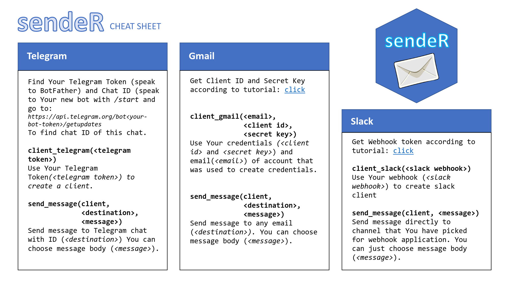

<!-- README.md is generated from README.Rmd. Please edit that file -->
sendeR 
-------------------------------------------------------

<!-- badges: start -->
[](https://travis-ci.com/tmakowski/sendeR) [](https://ci.appveyor.com/project/tmakowski/sendeR) [](https://codecov.io/gh/tmakowski/sendeR?branch=master) [](https://www.tidyverse.org/lifecycle/#maturing) [](https://opensource.org/licenses/MIT) <!-- badges: end -->

### Overview

sendeR is a package whose premise is sending messages to various messaging and/or mailing services using a simple unified interface with as little dependencies as possible.

Package originated as a project for an Advanced R course at a Faculty of Mathematics and Information Science at the Warsaw University of Technology.

### Installation

To install the development package version from GitHub repository use the following code:

``` r
# install.packages("devtools")
devtools::install_github("tmakowski/sendeR")
```

### Supported Services

Note: services requiring OAuth2.0 require `httr` and `openssl` packages installed.

-   [Gmail](https://gmail.com) **(OAuth2.0)**
-   [Slack](https://slack.com)
-   [Telegram](https://telegram.org/)

### Usage

1.  Create a client for one of the supported services. For details on how to get access to the service's API please refer to given client's documentation.
2.  Use `send_message` method on the created client.

``` r
library("sendeR")
my_telegram_client <- client_telegram(<my_bot_token>)
send_message(my_telegram_client, "Hello world!", <chat_id>)
```

As of version `0.9.0.9000` it is possible to set *default* parameters in the clients as shown below.

``` r
client <- client_telegram(<my_bot_token>)
client <- set_fields(client, destination = <chat_id>, message = "Hi world!")

# This will send "Hi world!" message to chat under <chat_id>.
send_message(client)

# This will send "Hello world!" message to chat under <chat_id>.
send_message(client, message = "Hello world!")
```

#### Additional Features

-   Version `0.9.0.9000` of the package comes with the `sendeR_lapply` function which can easily be used to send notifications after a calculation is finished. Please refer to the documentation for usage specifics.

#### Important Remarks

-   Creating `client_gmail` pauses code execution and waits for the OAuth2.0 authorization. This can be avoided in subsequent `client_gmail` calls if `httr` OAuth caching functionality is used.
-   Currently passing an argument of wrong type to any function will result in a code stop due to failed assertion. Please test your sendeR calls before running long calculations.

### Cheatsheet

[PDF Version](vignettes/cheatsheet/sendeR_cheatsheet.pdf) 

### How to contribute?

*Coming soon...*

### Planned Features

-   `quick_send_message` - method for sending messages in one line (client creation not required). Note: only for clients not requiring OAuth.
-   Searching system environment for required parameters during clients construction if they are missing.
