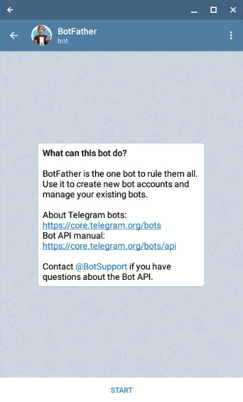
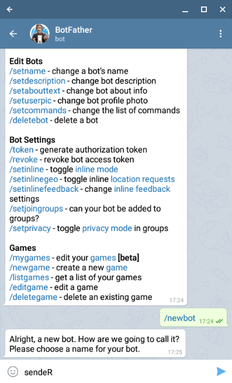
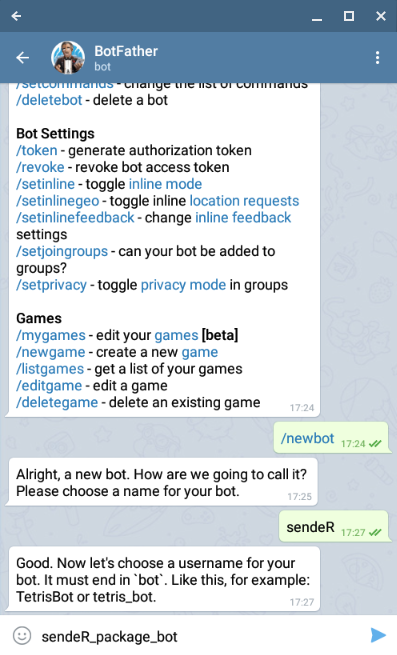
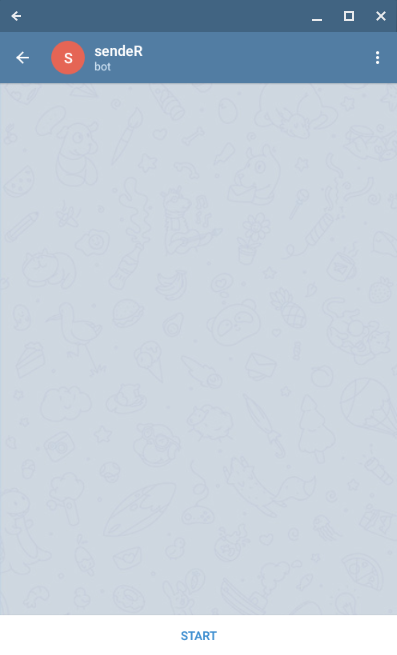
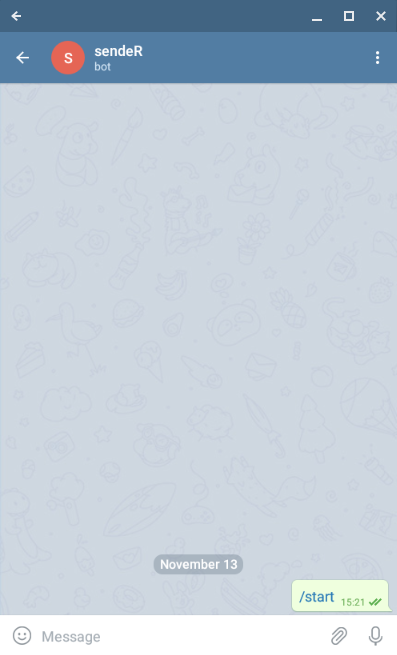

```{r, include = FALSE}
library(sendeR)
knitr::opts_chunk$set(collapse = TRUE, comment = "#>")
```

## Introduction

This document contains a description for every service implemented in the `sendeR` package on how to start sending messages with it. Each chapter contains information about acquiring either an API webhook, a token or some other form of credentials required for sending messages via the API.

Other than the API access acquisition usage of each client is very straightforward. With the acquired form of authorization we create a client for the service. Once the service client is created the `send_message` has three basic parameters:

 * `client` - the created client,
 * `message` - a text message to be sent,
 * `destination` - a chat id.

Additionally, a client specific arguments can be passed through the ellipsis. Those arguments are also covered below.


## Gmail
### Credentials acquisition
TODO(TK)

### Destination argument details
Destination for `client_gmail` simply is a recipient's email. It does not have
be your own email!

### Additional `send_message` arguments
`send_message.client_gmail` has one additional argument:

 * `subject` - a subject of the email message to be sent.


## Slack
### Credentials acquisition
TODO(TK)

### Destination argument details
For `client_slack` this argument is not used because the created webhook is tied to a specific channel what renders `destination` parameter redundant. However the argument has to be present for implementing the main `send_message` method.

### Additional `send_message` arguments
`send_message.client_slack` has no additional parameters as of now.


## Telegram
### Credentials acquisition
Creating a Telegram bot is really simply (simpler than guessing your chat id I would say!). To create the bow simply find the `@BotFather` - chat with it should look similarly to this:



Once the chat is started BotFather will send a message with available commands. The one which interests us is `/newbot`. After sending the command we will be prompted to enter our bot display name. 



Once the display name is provided we will be asked for bot's username, that is, the name which we can @tag the bot or search for it in the Telegram.



Once that is done BotFather will send the message with our bot's API token. This token is passed to the `client_telegram` function of `sendeR` package.


### Destination argument details
For Telegram client the `destination` argument is a chat_id where the message is supposed to be sent. Before sending messages we have to determine what is the chat id we want to use.

#### One on one chats
If we want to send messages to the one on one chat with bot. To do that open the chat with bot and initialize the chat by pressing `/start` as shown below.

 

Now we will use the bot to read our chat id. In order to do so head to `https://api.telegram.org/bot<your-bot-token>/getupdates`. Page should display a JSON response with no updates received by the bot:
```{r, eval = FALSE}
{
    "ok": true,
    "result": []
}
```

Sending an example message "Hello!" to the bot and refreshing the page should result in response containing information similar to the one below (among other parameters).
```{r, eval = FALSE}
{
    "ok": true,
    "result": [
        {
            "update_id": 164384282,
            "message": {
                "message_id": 2,
                "from": {
                    "id": your_user_id
                },
                "chat": {
                    "id": your_chat_id
                },
                "date": 1573660088,
                "text": "Hello!"
            }
        }
    ]
}
```

Here is the chat id (the `destination` parameter) we were looking for.

Note that the chat id and the user id are the same that is due to the user id being used as chat id for one on one chats.


#### Group chats
Similarly to the one on one chats we have to retrieve the information from `https://api.telegram.org/bot<your-bot-token>/getupdates` page.

To get group's chat id we need to add our bot to the group. Once the bot is added to the group an update containing following information should appear if we refresh the above page:
```{r, eval = FALSE}
{
    "ok": true,
    "result": [
        {
            "update_id": 164384283,
            "message": {
                "message_id": 3,
                "from": {
                    "id": your_user_id,
                },
                "chat": {
                    "id": your_group_id,
                    "type": "group"
                },
                "date": 1573661039,
                "group_chat_created": true
            }
        }
    ]
}
```

From the response we can extract the group id (note: group ids are negative numbers).


### Additional `send_message` arguments
`send_message.client_telegram` has no additional parameters as of now.
